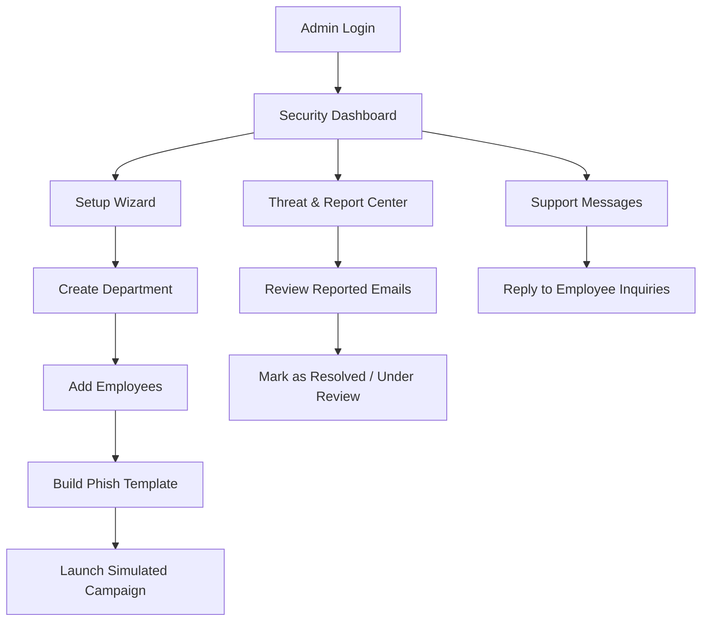
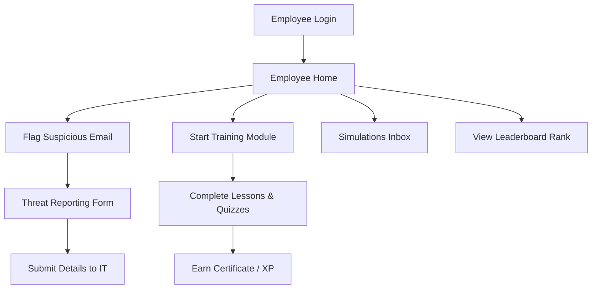
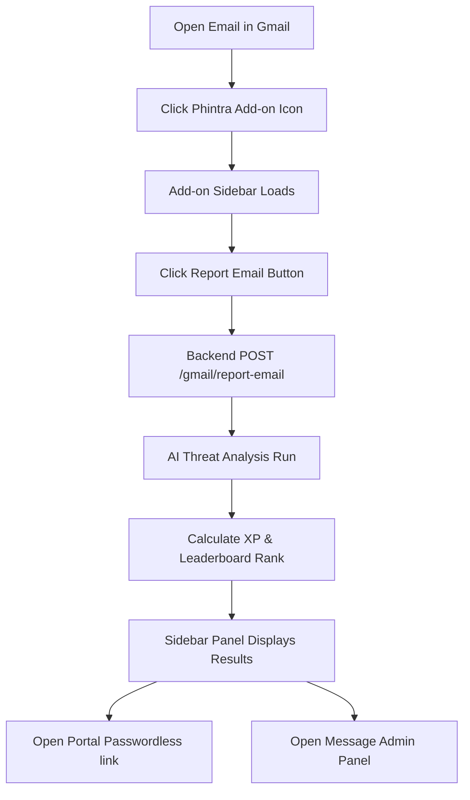
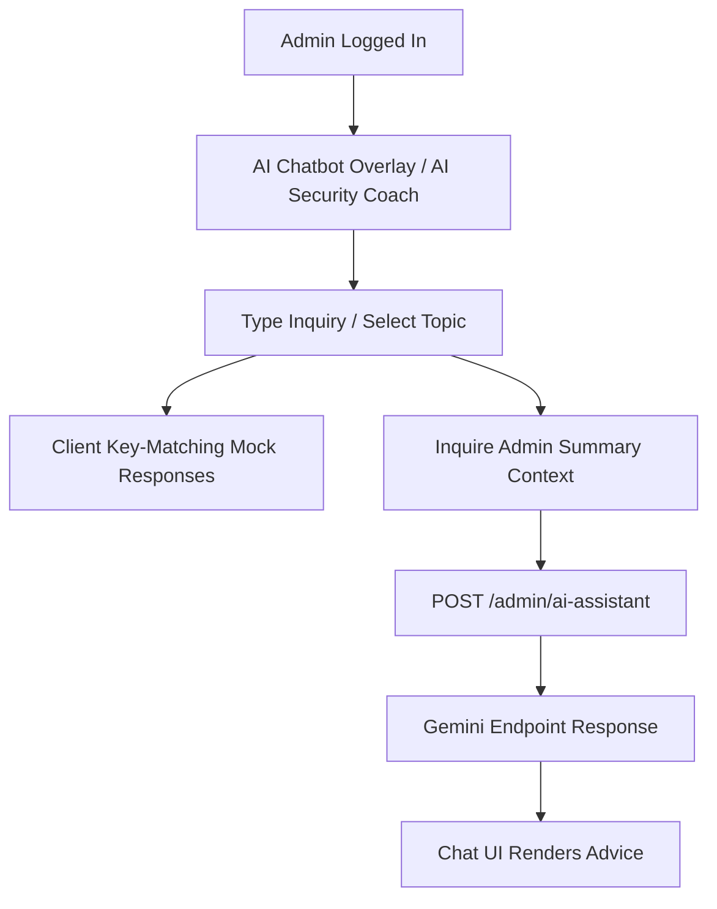

# Phintra Platform — Step-by-Step User Journey Flows

This document details the step-by-step user journeys and operational flows for every role supported by the **Phintra Phishing Awareness and Training Platform**.

---

## 1. Security Administrator / Manager Journey Flow

This flow maps the administrative lifecycle from authentication to campaign deployment and incident review.

### Step-by-Step Walkthrough

1. **Authentication:**
   - Admin accesses `/admin/login`.
   - Admin enters credentials. Upon validation, the auth context stores the secure JWT token in browser `localStorage`.
   - Accesses dashboard `/admin/dashboard` (Security Administrator) or `/admin/manager-dashboard` (Security Manager).

2. **Organizational Setup (New Tenants):**
   - Admin initiates the **Setup Wizard** on the dashboard.
   - **Step 1:** Inputs department details (name, description) -> sends `POST /departments`.
   - **Step 2:** Uploads or manual-adds employees -> sends `POST /employees`.
   - **Step 3:** Chooses baseline email template blueprint.
   - **Step 4:** Names simulation campaign drill.
   - **Step 5:** Dispatches SMTP test connection -> sends `POST /campaigns/{id}/send-test` -> clicks "Launch" -> sends `POST /campaigns/{id}/launch`.

3. **Campaign Control & Auditing:**
   - Navigates to `/admin/campaigns` to audit simulation lists.
   - Archives or sends manual reminders to employees -> sends `POST /campaigns/{id}/archive` or `POST /campaigns/{id}/remind`.
   - Accesses `/admin/email-logs` to inspect real-time SMTP transaction logs -> sends `GET /emails/logs`.

4. **Security Reporting & Resolution:**
   - Navigates to `/admin/reports` to inspect suspicious emails flagged by employees.
   - Selects an email row to slide open the AI Risk Drawer.
   - Reviews threat score and LLM breakdown.
   - Changes status tag (Resolved / Under Review) -> sends `PUT /reported-emails/{id}`.

5. **Employee Communications (Support):**
   - Navigates to `/admin/messages` to view pending feedback from reported campaigns.
   - Selects active employee thread, reads text, types reply -> sends `POST /messages/admin/reply`.

---

## 2. Employee User Journey Flow

This flow maps the employee lifecycle from authentication through awareness feedback.

### Step-by-Step Walkthrough

1. **Login & Interface Navigation:**
   - Employee logs in at `/user/login` using organizational email and credentials.
   - Employee dashboard `/user/dashboard` loads, fetching metrics (total XP, current security rating, active streak, leaderboard rank) from `GET /auth/employee/dashboard`.

2. **Training & Certification:**
   - Accesses `/user/training` to view assigned micro-learning modules.
   - Selects a module to play lessons and complete quizzes -> stores completion flags locally.
   - Earns certificates and XP points -> updates employee profile scores in database.

3. **Active Threat Reporting:**
   - Employee detects a suspicious email (or safe simulation) in their inbox.
   - Navigates to Threat Reporting Center `/user/report`.
   - Inputs sender address, subject, reason dropdown, body context, and optional attachment.
   - Clicks "Submit Report" -> sends `POST /reported-emails` -> triggers local AI threat grading -> updates database logs.

4. **Help & Support Feedback:**
   - Employee opens `/user/help` to request assistance.
   - Types message to security team -> sends `POST /messages/send`.

---

## 3. Gmail Add-on Reporting Journey Flow

This flow maps the path for employees to flag suspicious emails directly inside the Gmail client.

### Step-by-Step Walkthrough

1. **Activation:**
   - Employee opens Gmail client and selects any suspicious email message.
   - Clicks the **Phintra Add-on** icon in the sidebar.
   - Add-on triggers `Code.js` to extract current message parameters (Message ID, Thread ID, Subject, Sender, Body plain-text).

2. **Dispatch & AI Scoring:**
   - Employee clicks the **Report Suspicious Email** button.
   - Add-on issues an API request `POST /gmail/report-email` with header `X-PHINTRA-ADDON-KEY`.
   - Backend checks employee table:
     - If email not found -> returns `403 Forbidden` response.
     - If employee found -> fetches company details, triggers AI risk analysis (`analyze_email_risk` service), saves to `reported_emails`, awards XP, recalculates rank, and generates a passwordless URL token.

3. **Review & Actions:**
   - Add-on panel displays the results: Risk Score (0-100), Threat Level (Low/High), XP Earned, and Organization Leaderboard Rank.
   - Action buttons are provided:
     - **Open Dashboard:** Opens portal `/user/dashboard?token=...` allowing passwordless auto-login.
     - **Message Admin:** Displays textbox. Submitting triggers `POST /gmail/admin-message` to log support message threads directly in the admin console.

---

## 4. AI Campaign Agent & Chatbot Flow

This flow outlines the AI-assisted diagnostics and chatbot operations implemented on the platform.

### Step-by-Step Walkthrough

1. **AI Chatbot Overlay:**
   - Floating Chatbot is rendered globally on all admin paths (`src/components/common/FloatingAIChatbot.jsx`).
   - Admin opens chat bubbles, types security policy inquiries.
   - Client resolves request:
     - Uses client-side key-matching for standard security questions.
     - Performs a backend call to `POST /admin/ai-assistant` if Gemini model integrations are active.
   - Assistant answers back with target recommendations.

2. **AI Diagnostics Monitor:**
   - Admin accesses `/admin/ai-debug` diagnostics panel.
   - Clicks **Retest AI Connection** -> calls Hugging Face Inference API helper.
   - Verifies server connectivity, active model status, response logs, and headers.

3. **AI Automated Campaign Agent:**
   - *Pending / Not Implemented:* Fully autonomous campaign builders that automatically generate, schedule, and send mock emails based on company profile data are not implemented. AI capabilities are currently focused on risk analytics scoring, chatbot support assistance, and Hugging Face connectivity diagnostics.

---

## 5. Source Traceability

### Scanned Flow Components
- Gmail Add-on Google Apps Script: [Code.js](file:///c:/Sathyasudar/demo-react-project/gmail-addon/Code.js)
- Frontend Context & Routing: [AppRoutes.jsx](file:///c:/Sathyasudar/demo-react-project/phishguard-ai/src/routes/AppRoutes.jsx), [AppContext.jsx](file:///c:/Sathyasudar/demo-react-project/phishguard-ai/src/context/AppContext.jsx)
- Backend Gmail routes: [gmail.py](file:///c:/Sathyasudar/demo-react-project/backend/app/routes/gmail.py)
- Backend AI assistant routes: [ai_assistant.py](file:///c:/Sathyasudar/demo-react-project/backend/app/routes/ai_assistant.py)
- AI Chatbot components: [FloatingAIChatbot.jsx](file:///c:/Sathyasudar/demo-react-project/phishguard-ai/src/components/common/FloatingAIChatbot.jsx), [AISecurityCoach.jsx](file:///c:/Sathyasudar/demo-react-project/phishguard-ai/src/pages/admin/AISecurityCoach.jsx)
